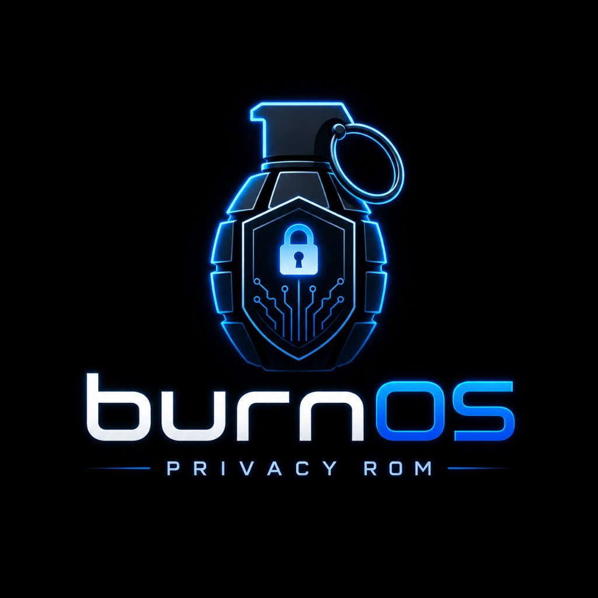
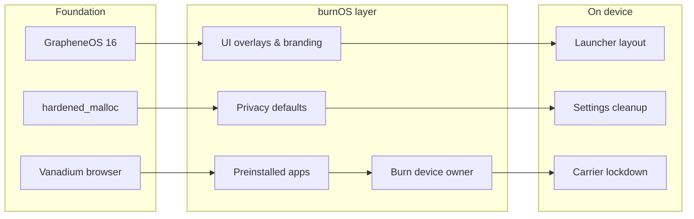
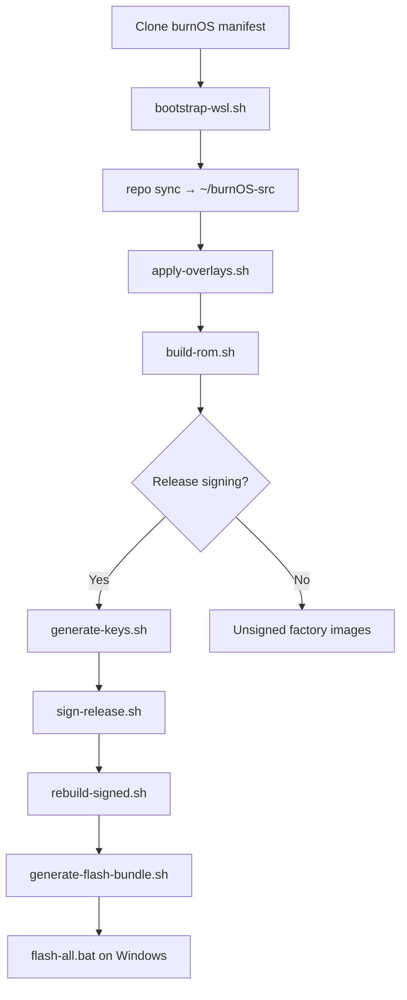

<pre align="center">
╔══════════════════════════════════════════════════════════╗
║                                                          ║
║   burnOS  ·  privacy &amp; security  ·  operational use   ║
║                                                          ║
╚══════════════════════════════════════════════════════════╝
</pre>

<p align="center">
  
</p>

<p align="center">
  <strong>Privacy-first Android for operational use</strong><br/>
  Built on GrapheneOS · Pixel 7 &amp; 7a · Android 16 QPR2
</p>

<p align="center">
  <a href="https://github.com/burn-project/burnOS"></a>
  <a href="https://github.com/burn-project/burnOS"></a>
  <a href="https://github.com/burn-project/burnOS"></a>
  <a href="https://github.com/burn-project/burnOS"></a>
</p>

---

## Overview

**burnOS** is a hardened, branded Android distribution derived from [GrapheneOS](https://grapheneos.org/). It strips consumer features, preloads a curated privacy stack, and ships with strict defaults for devices used in sensitive operational contexts.

| | |
|---|---|
| **Codename** | burnOS |
| **Tagline** | Privacy & security |
| **Base** | GrapheneOS `16-qpr2` / AOSP `android-16.0.0_r4` |
| **Targets** | Pixel 7 (`panther`) · Pixel 7a (`lynx`) |
| **Operator display** | `burn.tel` |

> **Important — read before use**
>
> burnOS **cannot place emergency calls** (999, 911, 112, or equivalent). Do not store irreplaceable data on the device. Anti-tamper protections may permanently destroy stored data. Full terms appear in Settings → About phone → Use & liability.

---

## What makes burnOS different



### Privacy & security defaults

| Setting | Default |
|---------|---------|
| Dark mode | On |
| USB connection | Charge only (no MTP/PTP) |
| Wi‑Fi / BLE background scanning | Off |
| Network location | Removed |
| Carrier data access | Locked down |
| eSIM system UI | Enabled |
| GMS compatibility layer | Kept |
| UWB | Kept |

### Removed or hidden

Calendar · Dialer · Emergency SOS · MMS · Health Connect UI · Bluetooth settings UI · Weather widget · TalkBack · Network location · App Store · Auditor · Theme / wallpaper pickers · and other consumer cruft defined in `burn/spec.yml`.

### Preinstalled apps

| App | Role |
|-----|------|
| **Burn** (`com.burner.tel`) | Device owner / DPC — auto-provisioned on first boot |
| **F-Droid** | App catalog + Guardian Project repo |
| **Threema Libre** | Encrypted messaging |
| **Zerion** | Wallet |
| **WireGuard** | VPN |
| **Signal** | *You must supply the APK — not redistributed in this repo* |

Core GrapheneOS apps retained: Messaging, Contacts, Vanadium, Camera, Gallery, PdfViewer, Seedvault, Updater, and related compatibility modules.

### Launcher & branding

- Custom burn icon across Settings, Launcher3, and system overlays
- Curated hotseat: Signal · Threema · Settings · Vanadium · Camera
- First screen: messaging, F-Droid, contacts, browser, camera, gallery, and more
- Branded home & lock wallpapers (`burn/branding/wallpaper/`)

---

## Repository layout

```
burnOS/
├── config.yml              # adevtool manifest source (GrapheneOS fork config)
├── default.xml             # Generated repo manifest
├── burn/
│   ├── spec.yml            # Product spec — packages, privacy, preinstalls
│   ├── menus.yml           # Settings / launcher UI customization
│   ├── apply-overlays.sh   # Patch synced tree after repo sync
│   ├── bootstrap-wsl.sh    # First-time WSL environment + repo sync
│   ├── build-rom.sh        # Full ROM build (panther default)
│   ├── rebuild-signed.sh   # Compile, sign, export flash bundle
│   ├── sign-release.sh     # AVB / release signing
│   ├── generate-flash-bundle.sh
│   ├── branding/           # Icons, wallpapers, about-page assets
│   ├── overlays/           # Settings, Launcher3, framework patches
│   ├── prebuilt/           # Privileged APKs (Burn, F-Droid, etc.)
│   └── vendor/             # burn.mk, provision scripts, init rc
├── flash-all.bat           # Windows fastboot flash (signed builds)
└── keys/                   # Local signing keys — gitignored, never commit
```

Configuration is declarative: edit `burn/spec.yml` and `burn/menus.yml`, then run `burn/apply-overlays.sh` against your synced tree.

---

## Build from source

Requirements: **Ubuntu 24.04 in WSL2**, **~300 GiB free on the Linux filesystem** (not `/mnt/c`), 16+ GiB RAM recommended.

### 1 · Bootstrap

```bash
git clone https://github.com/burn-project/burnOS.git
cd burnOS
bash burn/bootstrap-wsl.sh
```

Optional faster sync: `bash burn/bootstrap-wsl.sh --fast`

### 2 · Apply burnOS overlays

After `repo sync` completes inside `~/burnOS-src`:

```bash
bash burn/apply-overlays.sh
```

Set `SYNC_DIR` if your tree lives elsewhere:

```bash
SYNC_DIR=/path/to/burnOS-src bash burn/apply-overlays.sh
```

### 3 · Build

```bash
bash burn/build-rom.sh          # full sync + build
bash burn/build-rom.sh --fast   # skip repo sync when tree is current
```

Default device: `panther` (Pixel 7). Override with `DEVICE=lynx`.

### 4 · Sign & flash (optional)

Generate release keys once:

```bash
bash burn/generate-keys.sh
```

Signed rebuild + Windows flash bundle:

```bash
wsl -d Ubuntu -u build bash burn/rebuild-signed.sh
```

Copy the bundle to a folder with `flash-all.bat`, connect the Pixel in fastboot, and run the batch script from Windows. Bootloader lock requires a signed build with your `avb_pkmd.bin`.

---

## Build pipeline



Logs default to `~/burnOS-logs/`. Use `burn/watch-build.sh` to tail progress.

---

## Device owner provisioning

Burn auto-provisions as device owner on first boot when no accounts exist. Manual fallback after factory reset:

```bash
adb shell dpm set-device-owner com.burner.tel/com.burn.app.service.BurnDeviceAdminReceiver
adb shell pm grant com.burner.tel android.permission.WRITE_SECURE_SETTINGS
```

First-boot scripts under `burn/vendor/etc/burn/` also configure F-Droid extra repos, system defaults, and carrier lockdown.

---

## Supported devices

| Device | Codename | Kernel tree |
|--------|----------|-------------|
| Pixel 7 | `panther` | `device/google/pantah-kernels/6.1` |
| Pixel 7a | `lynx` | `device/google/lynx-kernels/6.1` |

Additional Pixel kernel paths are declared in `config.yml` for future expansion.

---

## Contributing

1. Fork and branch from `16-qpr2`
2. Change product behavior in `burn/spec.yml` or UI in `burn/menus.yml`
3. Run `apply-overlays.sh` and verify on a synced tree
4. Open a PR with a clear description of privacy / UX impact

Do **not** commit signing keys, `avb_pkmd.bin`, or proprietary APKs (Signal).

---

## Credits & licenses

burnOS builds on the excellent work of the **[GrapheneOS](https://grapheneos.org/)** project and Android Open Source Project. See `COPPERHEAD-NOTICE` for upstream licensing history.

Prebuilt third-party apps remain subject to their respective licenses. Build artifacts inherit GPL-2.0 / Apache-2.0 terms from upstream components.

<details>
<summary>GitHub social preview</summary>

Upload [`docs/social-preview.png`](docs/social-preview.png) (1280×640) via **Settings → General → Social preview** so link shares show the burnOS card.

</details>

---

<p align="center">
  <sub>burnOS · burn.tel · operational privacy by design</sub>
</p>
